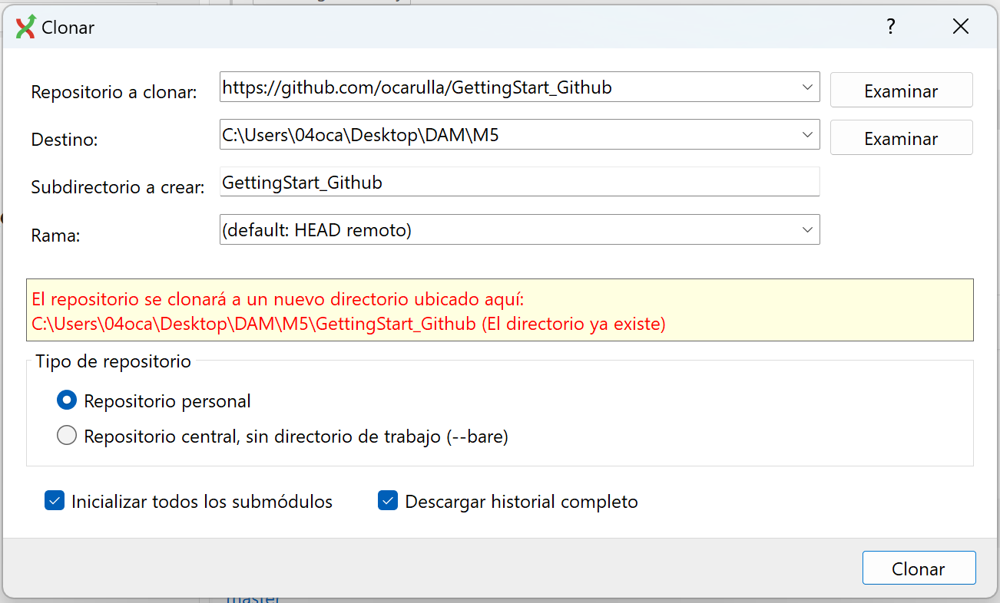

# E2 Contributing
## Instalar el Git Extension
Lo primero que hay que hacer es instalar el Git extension. A mi por ejemplo me ha pedido que me instale un acosa del .NET, sin problema instalaremos lo necesario y seguiremos con la instalación.

## Clonar el repositorio
Ahora nos preguntara de donde queremos clonar el repositorio, indicaremos la URL que deseamos y luego el destino del repositorio de forma local, entre otras caracteristicas.  
